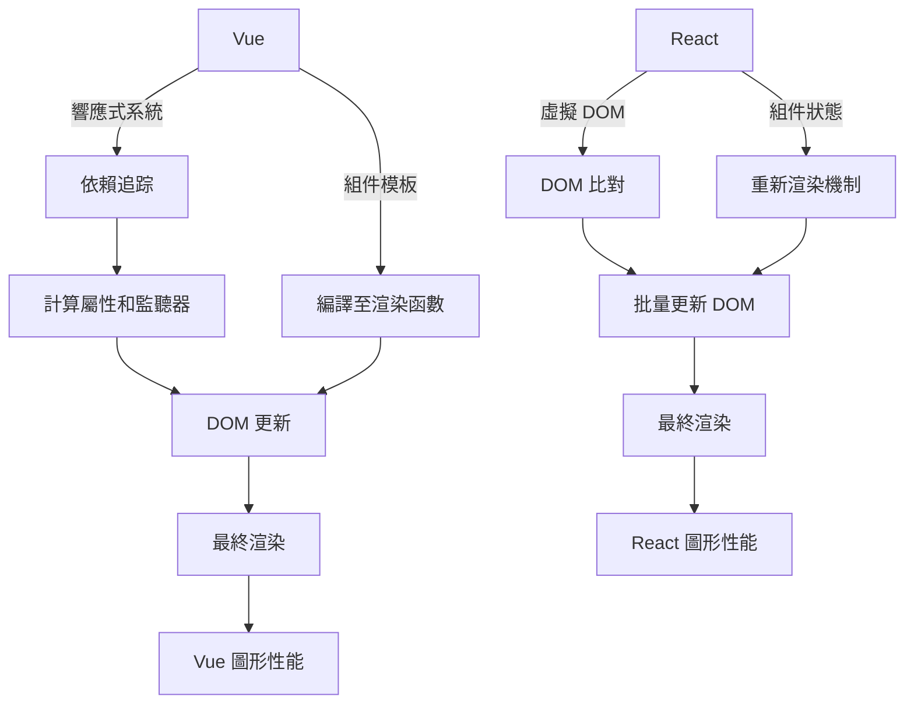

> 用 React Chart 畫一個台灣 [GEO_TW](https://geo-tw.zeabur.app/) 🤪

::alert{type="waring" icon="lucide:lightbulb"}

本頁面持續更新中 ⛑️

::

因開發需求，需要 Survey 可以繪畫出世界地圖的圖表，於是嘗試使用 react 生態系相關的 GEO 圖表套件庫。

## 畫地圖需要什麼?

在今天，地圖不僅是導航工具，也是呈現和分析地理數據的重要方式。想要創建一幅具有互動性和功能性的地圖互動模式，需要先了解基本且關鍵的要素：

### 地理數據

地理數據是指描述地球表面特征的數據。這包括山脈、河流、道路、建築物等的位置以及其他相關信息。這些數據是地圖的基礎元素，確保我們能夠準確地描繪出一個地區的地理狀態。正確且最新的地理數據可以幫助用戶做出更好的決策和深入的分析。

### 座標系統

座標系統是用於確定地球表面各點位置的系統。地理座標系統（以經度和緯度表示）是最普遍使用的一種，它幫助我們確定任何位置的精確坐標。選擇適當的座標系統對於確保地圖的準確性至關重要，因為不同的系統可能會導致位置的微小偏差。

### GeoJSON 和 TopoJSON

- **GeoJSON**：這是一種基於 JSON（JavaScript Object Notation）的格式，用於編碼各種地理數據結構。GeoJSON 是開放的標準格式，支持各種地圖應用，與 JavaScript 的兼容性極佳。

- **TopoJSON**：這是 GeoJSON 的一個擴展，專門用於存儲更為複雜的地理拓撲結構。TopoJSON 通過合併相鄰的地區和消除冗餘的邊界，有效地減少了文件大小，同時保持了地圖的高精度和細節。這使得 TopoJSON 非常適合那些需要處理大量地理數據的應用。

### 地圖繪製的 library

利用適當的工具和 library 來實現地圖的可視化是至關重要的。在 React 生態系中，我們有許多強大的庫如 React-simple-maps 和 React-leaflet，這些 library 提供了豐富的 API 和組件，使得開發者可以更輕鬆地整合地圖功能到現代的網頁應用中。

## D3是繪圖表始祖?

在談到網頁上的數據視覺化，我們不得不提 D3.js，這是一個 JavaScript library，它允許開發者使用網頁標準直接在瀏覽器中操作文檔來生成複雜的視覺圖形。D3代表 Data-Driven Documents，即數據驅動的文件，它結合了 HTML、SVG 和 CSS 的功能，提供了一個強大的畫圖和數據處理平台。

### 核心特性

D3的核心在於它的功能強大和靈活性。開發者可以利用 D3 綁定任意的數據到一個 DOM，然後根據這些數據來進行元素的變換，包括但不限於使用數據來生成圖表、圖形和其他視覺化格式。D3 的核心特性包括：

- **數據綁定**：D3 強大的數據綁定能力使得數據與視覺元素之間的連接更加緊密和動態。
- **動態屬性**：使用 D3，開發者可以輕鬆地根據數據動態改變元素的屬性，如大小、顏色和位置。
- **豐富的圖表類型**：D3 支援各種圖表類型，包括地理地圖、樹形圖、堆疊圖等，並允許高度客制化。

### 創新性和影響

D3.js 的創新性在於它不依賴於專有框架，而是直接使用網頁標準。這意味著它可以在任何現代瀏覽器上運行而不需要額外的插件。D3的設計理念是將控制權交給開發者，使他們可以創建完全定制的視覺效果。

### D3 範例

[基本柱狀圖](https://codepen.io/eepson123tw/full/gOJOqPQ)

寫一個 D3.js 在數據視覺化中的基本範例，包括數據綁定、動態屬性設定和 SVG 操作。
當然還有更多更複雜的實現，都在官網裡 😇

## React 地圖繪製套件比較

以下表格展示了各個 React 地圖繪製套件的主要特點、優勢以及基本的使用案例鏈接：

| 圖表套件                | 主要特點與優勢                                               | 基本使用方法案例                                                                              |
| ----------------------- | ------------------------------------------------------------ | --------------------------------------------------------------------------------------------- |
| **Visx**                | 由 Airbnb 開發，提供低級繪圖能力，高度自定義，輕量級。       | [Visx Geo Mercator](https://airbnb.io/visx/geo-mercator)                                      |
| **Highcharts Maps**     | 功能豐富，支持大量地圖類型和高度互動性，廣泛的 API 支持。    | [Animated Mapline](https://www.highcharts.com/demo/maps/animated-mapline)                     |
| **ECharts**             | 由百度開發，支持豐富的圖表類型和大數據視覺化。               | [Map USA Projection](https://echarts.apache.org/examples/zh/editor.html?c=map-usa-projection) |
| **react-simple-maps**   | 專門針對地圖繪製而設計的輕量級套件，易於集成和使用。         | [Simple Maps](https://www.react-simple-maps.io/)                                              |
| **React Leaflet**       | 基於 Leaflet 的 React 版本，適用於輕量級地圖應用，擴展性強。 | [Popup Marker Example](https://react-leaflet.js.org/docs/example-popup-marker/)               |
| **chartjs-chart-geo**   | 將 Chart.js 擴展到地理數據，支持現代瀏覽器和簡單API。        | [Chartjs Geo](https://www.npmjs.com/package/chartjs-chart-geo)                                |
| **react-google-charts** | 融合 Google Charts 強大的繪圖能力，支持多種圖表類型。        | [Google Charts React](https://www.react-google-charts.com/)                                   |
| **D3**                  | 高度靈活和動態的視覺化圖書館，專為復雜和創新的視覺化設計。   | [D3 Official](https://d3js.org/)                                                              |

### 圖表套件詳細介紹

1. **Visx**
   Visx 結合了 React 的可組合性與 D3 的計算能力，特別適合需要高度自定義的項目。由於其只關注底層繪圖邏輯，開發者可以自由設計視覺效果，不受限於預設的樣式。

2. **Highcharts Maps**
   Highcharts 提供了一個極其豐富的地圖繪製功能，包括互動性圖表、動態更新的地圖等。它的 API 支持廣泛，能夠應對大多數的商業需求。

3. **ECharts**
   ECharts 支持的圖表類型非常多樣，從簡單的折線圖到複雜的地理數據視覺化都能夠處理，且適合需要處理大量數據的應用。

4. **react-simple-maps**
   此套件專為簡單的地圖視覺化設計，並且提供了易於使用的 API，非常適合需要快速結果的項目。

5. **React Leaflet**
   React Leaflet 使得集成 Leaflet 地圖變得輕而易舉，並且支持廣泛的插件生態系統，使得定制化和功能擴展非常方便。

6. **chartjs-chart-geo**
   此套件擴展了 Chart.js，使其能夠處理地理數據。保留了 Chart.js 的簡潔和易用性，並且新增了地圖繪製的功能。

7. **react-google-charts**
   集成了 Google Charts 的強大功能，允許開發者快速部署各種圖表，包括地圖，並且支持豐富的配置選項和數據類型。「 但要花錢買 api 」💰

8. **D3**
   D3 是數據視覺化的一個強大工具，它提供了廣泛的自定義選項，適合需要進行復雜數據操作和創新視覺表現的專案。

## React 與 Vue 簡單繪圖比較

### React

- 虛擬 DOM 處理：
  React 使用虛擬 DOM 來減少直接對真實 DOM 的操作，這對於繪圖和大型應用來說，可以大幅提升性能。
  當數據發生變化時，React 會計算新的虛擬 DOM 與舊的虛擬 DOM 的差異，並只更新變更的部分，且更接近原生 js 的操作模式，可以避開較多的副作用。
- 組件化和可擴展性：
  React 的組件化結構使得擴展和維護大型繪圖應用更加方便。每個組件負責維護自己的狀態，並可重用於不同的繪圖場景。
  大型網頁開發中，React 組件可以很容易地與繪圖庫（如 D3.js、Chart.js）集成，實現複雜的視覺效果。

### Vue

- 響應式數據綁定：
  Vue 的響應式系統通過依賴追踪自動更新 DOM，這對於繪圖意味著任何數據的變化都會即時反映在圖形上，無需手動介入。
  變更檢測是自動化的，當使用 Vue 開發動態圖表時，自動化使得開發更加直觀和較少錯誤，但開發者需要更高的素養去控制依賴及驅動時的互相影響。
- 模板和渲染函數的彈性：
  Vue 的模板語法和可選的 JSX 支持，使得在 Vue 中創建動態圖表變得非常靈活和強大。
  對於複雜的視覺效果，我們可以利用模板或直接的渲染函數來精細控制 DOM 的輸出，但可使用的 library 會較少，我的經驗中最後使用 d3 開發動態圖表。

### Reference

- [Visx](https://airbnb.io/visx/geo-mercator)
- [highChart](https://www.highcharts.com/demo/maps/animated-mapline)
- [EChart](https://echarts.apache.org/examples/zh/editor.html?c=map-usa-projection)
- [react-simple-maps](https://www.react-simple-maps.io/)
- [React leaflet](https://react-leaflet.js.org/docs/example-popup-marker/)
- [chartjs-chart-geo](https://www.npmjs.com/package/chartjs-chart-geo)
- [react-google-charts](https://www.react-google-charts.com/)
- [d3](https://d3js.org/)

### 圖資

- [World geo from highChart](https://code.highcharts.com/mapdata/)
- [Taiwan geo data](https://github.com/dkaoster/taiwan-atlas?tab=readme-ov-file#tw.objects.towns)
