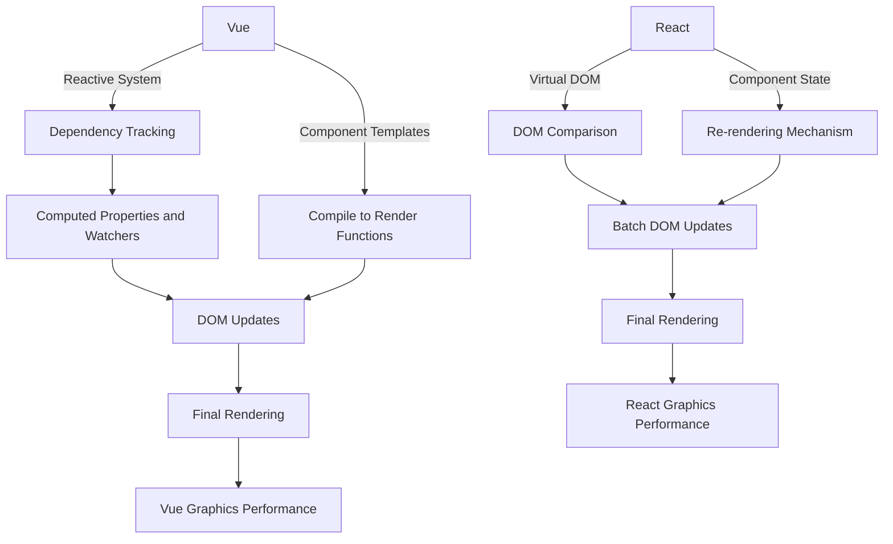

> Drawing Taiwan with React Charts [GEO_TW](https://geo-tw.zeabur.app/) 🤪

::alert{type="waring" icon="lucide:lightbulb"}

This page is continuously being updated ⛑️

::

Due to development requirements, I needed to survey chart libraries that can draw world maps, so I tried using GEO chart libraries related to the React ecosystem.

## What Do You Need to Draw Maps?

Today, maps are not only navigation tools but also important ways to present and analyze geographic data. To create an interactive and functional map interaction mode, you need to understand basic and key elements:

### Geographic Data

Geographic data refers to data that describes features on the Earth's surface. This includes the location of mountains, rivers, roads, buildings, and other related information. This data is the basic element of maps, ensuring we can accurately depict the geographic state of a region. Correct and up-to-date geographic data can help users make better decisions and conduct in-depth analysis.

### Coordinate Systems

Coordinate systems are systems used to determine the position of points on the Earth's surface. Geographic coordinate systems (expressed in longitude and latitude) are the most commonly used type, helping us determine precise coordinates for any location. Choosing an appropriate coordinate system is crucial for ensuring map accuracy, as different systems may cause slight deviations in position.

### GeoJSON and TopoJSON

- **GeoJSON**: This is a JSON (JavaScript Object Notation) based format for encoding various geographic data structures. GeoJSON is an open standard format that supports various map applications and has excellent compatibility with JavaScript.

- **TopoJSON**: This is an extension of GeoJSON specifically designed to store more complex geographic topological structures. TopoJSON effectively reduces file size by merging adjacent regions and eliminating redundant boundaries while maintaining high precision and detail in maps. This makes TopoJSON very suitable for applications that need to process large amounts of geographic data.

### Map Drawing Libraries

Using appropriate tools and libraries to implement map visualization is crucial. In the React ecosystem, we have many powerful libraries like React-simple-maps and React-leaflet, which provide rich APIs and components, making it easier for developers to integrate map functionality into modern web applications.

## Is D3 the Ancestor of Chart Drawing?

When talking about data visualization on web pages, we must mention D3.js, a JavaScript library that allows developers to manipulate documents directly in browsers using web standards to generate complex visual graphics. D3 stands for Data-Driven Documents, combining the functionality of HTML, SVG, and CSS to provide a powerful drawing and data processing platform.

### Core Features

The core of D3 lies in its powerful functionality and flexibility. Developers can use D3 to bind arbitrary data to a DOM, then perform element transformations based on this data, including but not limited to using data to generate charts, graphics, and other visualization formats. D3's core features include:

- **Data Binding**: D3's powerful data binding capability makes the connection between data and visual elements more intimate and dynamic.
- **Dynamic Properties**: Using D3, developers can easily change element properties dynamically based on data, such as size, color, and position.
- **Rich Chart Types**: D3 supports various chart types, including geographic maps, tree diagrams, stacked charts, etc., and allows high customization.

### Innovation and Impact

The innovation of D3.js lies in its independence from proprietary frameworks, instead directly using web standards. This means it can run on any modern browser without additional plugins. D3's design philosophy is to give control to developers, allowing them to create completely customized visual effects.

### D3 Example

[Basic Bar Chart](https://codepen.io/eepson123tw/full/gOJOqPQ)

Writing a basic D3.js example in data visualization, including data binding, dynamic property setting, and SVG operations.
Of course, there are many more complex implementations available on the official website 😇

## React Map Drawing Library Comparison

The following table shows the main features, advantages, and basic use case links for various React map drawing libraries:

| Chart Library           | Main Features & Advantages                                                  | Basic Usage Examples                                                                           |
| ----------------------- | --------------------------------------------------------------------------- | ---------------------------------------------------------------------------------------------- |
| **Visx**                | Developed by Airbnb, provides low-level drawing capabilities, highly customizable, lightweight. | [Visx Geo Mercator](https://airbnb.io/visx/geo-mercator)                                      |
| **Highcharts Maps**     | Feature-rich, supports numerous map types and high interactivity, extensive API support. | [Animated Mapline](https://www.highcharts.com/demo/maps/animated-mapline)                     |
| **ECharts**             | Developed by Baidu, supports rich chart types and big data visualization. | [Map USA Projection](https://echarts.apache.org/examples/zh/editor.html?c=map-usa-projection) |
| **react-simple-maps**   | Lightweight library specifically designed for map drawing, easy to integrate and use. | [Simple Maps](https://www.react-simple-maps.io/)                                              |
| **React Leaflet**       | React version based on Leaflet, suitable for lightweight map applications, highly extensible. | [Popup Marker Example](https://react-leaflet.js.org/docs/example-popup-marker/)               |
| **chartjs-chart-geo**   | Extends Chart.js to geographic data, supports modern browsers and simple API. | [Chartjs Geo](https://www.npmjs.com/package/chartjs-chart-geo)                                |
| **react-google-charts** | Integrates Google Charts' powerful drawing capabilities, supports multiple chart types. | [Google Charts React](https://www.react-google-charts.com/)                                   |
| **D3**                  | Highly flexible and dynamic visualization library, designed for complex and innovative visualizations. | [D3 Official](https://d3js.org/)                                                              |

### Detailed Chart Library Introduction

1. **Visx**
   Visx combines React's composability with D3's computational power, particularly suitable for projects requiring high customization. Since it only focuses on low-level drawing logic, developers can freely design visual effects without being limited by preset styles.

2. **Highcharts Maps**
   Highcharts provides extremely rich map drawing functionality, including interactive charts, dynamically updated maps, etc. Its API support is extensive and can handle most commercial requirements.

3. **ECharts**
   ECharts supports a very diverse range of chart types, from simple line charts to complex geographic data visualization, and is suitable for applications that need to process large amounts of data.

4. **react-simple-maps**
   This library is designed specifically for simple map visualization and provides easy-to-use APIs, making it very suitable for projects that need quick results.

5. **React Leaflet**
   React Leaflet makes integrating Leaflet maps effortless and supports a broad plugin ecosystem, making customization and feature extension very convenient.

6. **chartjs-chart-geo**
   This library extends Chart.js to handle geographic data. It maintains Chart.js's simplicity and ease of use while adding map drawing functionality.

7. **react-google-charts**
   Integrates Google Charts' powerful functionality, allowing developers to quickly deploy various charts, including maps, with rich configuration options and data type support. "But you need to pay for API" 💰

8. **D3**
   D3 is a powerful tool for data visualization that provides extensive customization options, suitable for projects requiring complex data manipulation and innovative visual representation.

## Simple Drawing Comparison Between React and Vue

### React

- Virtual DOM Processing:
  React uses Virtual DOM to reduce direct manipulation of real DOM, which can significantly improve performance for drawing and large applications.
  When data changes, React calculates the difference between new and old Virtual DOM and only updates the changed parts, and it's closer to native JavaScript operation mode, avoiding many side effects.
- Componentization and Scalability:
  React's component structure makes extending and maintaining large drawing applications more convenient. Each component maintains its own state and can be reused in different drawing scenarios.
  In large web development, React components can easily integrate with drawing libraries (like D3.js, Chart.js) to achieve complex visual effects.

### Vue

- Reactive Data Binding:
  Vue's reactive system automatically updates DOM through dependency tracking, which means any data changes are immediately reflected in graphics without manual intervention.
  Change detection is automated, making development more intuitive and less error-prone when developing dynamic charts with Vue, but developers need higher expertise to control dependencies and their mutual effects during updates.
- Template and Render Function Flexibility:
  Vue's template syntax and optional JSX support make creating dynamic charts in Vue very flexible and powerful.
  For complex visual effects, we can use templates or direct render functions to finely control DOM output, but fewer libraries may be available. In my experience, I ended up using d3 to develop dynamic charts.

### Reference

- [Visx](https://airbnb.io/visx/geo-mercator)
- [highChart](https://www.highcharts.com/demo/maps/animated-mapline)
- [EChart](https://echarts.apache.org/examples/zh/editor.html?c=map-usa-projection)
- [react-simple-maps](https://www.react-simple-maps.io/)
- [React leaflet](https://react-leaflet.js.org/docs/example-popup-marker/)
- [chartjs-chart-geo](https://www.npmjs.com/package/chartjs-chart-geo)
- [react-google-charts](https://www.react-google-charts.com/)
- [d3](https://d3js.org/)

### Map Data

- [World geo from highChart](https://code.highcharts.com/mapdata/)
- [Taiwan geo data](https://github.com/dkaoster/taiwan-atlas?tab=readme-ov-file#tw.objects.towns)
