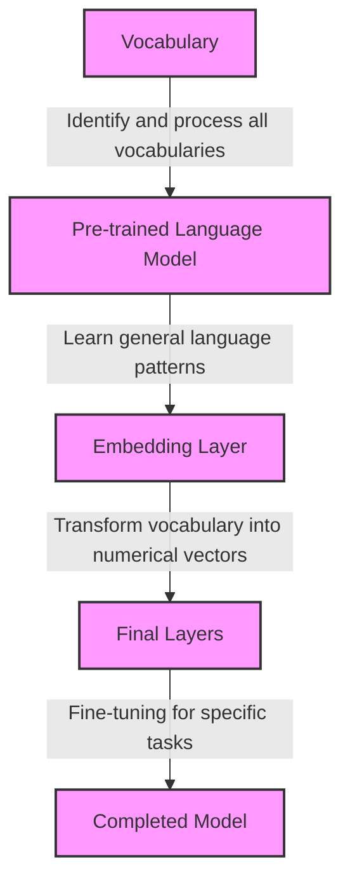
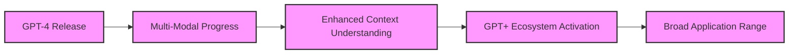

> 探索 ChatGPT：從理論到實踐的技術突破

本文旨在探討 ChatGPT 技術的理論基礎及其在各領域的實際應用。

從其起源、發展，到未來的可能性，我們將深入分析這項革命性技術如何改變人工智能領域。

## ChatGPT 技術概述

| **特點**     | **描述**                                                                | **意義**                                                                   |
| ------------ | ----------------------------------------------------------------------- | -------------------------------------------------------------------------- |
| 語言模型基礎 | ChatGPT 基於大規模轉換器（Transformer）模型，專注於理解和生成自然語言。 | 這種模型的能力超越了傳統的自然語言處理方法，允許更加準確和流暢的語言生成。 |
| 深度學習技術 | 使用深度學習算法來分析和理解大量文本數據。                              | 能夠從複雜的數據集中學習語言的細微差異和語境，從而提高溝通質量。           |
| 上下文理解   | 能夠根據上下文生成相關且連貫的回答或文本。                              | 與傳統模型相比，提供更為自然和人性化的交互體驗。                           |
| 自我學習能力 | 模型通過持續的學習和調整來改善其表現。                                  | 確保模型隨著時間的推移而不斷進步，適應新的語言模式和用戶需求。             |
| 多樣性應用   | 可應用於各種領域，如客服、內容創作、教育等。                            | 展示了其作為一種通用工具的潛力，能夠跨行業提供支持。                       |
| 持續演進     | 隨著技術的發展，模型不斷進行迭代和優化。                                | 確保技術能夠跟上最新的研究發現和市場需求。                                 |

## 技術演進與創新

| **發展階段** | **關鍵技術/特點**                                     | **代表性模型/應用**                                        |
| ------------ | ----------------------------------------------------- | ---------------------------------------------------------- |
| 人工智慧初期 | 硬編碼的規則和邏輯，模擬專家決策過程。                | 專家系統：DENDRAL（化學分析），MYCIN（醫療診斷）。         |
| 統計學習階段 | 統計方法，從數據中發現模式。                          | HMM（語音識別），SVM（影像識別）。                         |
| 深度學習     | 多層神經網絡，複雜模式識別。注意力機制（Attention）。 | CNNs（如AlexNet，影像識別），Seq2Seq（如LSTM，機器翻譯）。 |
| 預訓練階段   | 預訓練技術，學習語言通用模式。                        | Transformer（BERT，自然語言處理），GPT-2（自監督學習）。   |
| 大規模模型   | 大量數據和計算資源，高水平語言理解和生成。            | GPT-3（少量學習能力），GPT-4（更大參數量和知識基礎）。     |

## 核心算法解析

| **算法/技術**                              | **創新點**                                   | **技術實現**                                                       | **應用**                                          |
| ------------------------------------------ | -------------------------------------------- | ------------------------------------------------------------------ | ------------------------------------------------- |
| ELMo（Embeddings from Language Models）    | 使用兩個方向的語言模型來捕捉單詞的豐富語義。 | 運用LSTM網絡訓練左至右和右至左的模型。                             | 作為預訓練嵌入，增強現有模型的語境理解能力。      |
| 嵌入（Embeddings）                         | 轉化文字為機器可理解的數字形式。             | 詞嵌入將單詞表示為高維空間中的向量，上下文嵌入考慮單詞的周圍語境。 | 應用於文本分類、情感分析、機器翻譯等多種NLP任務。 |
| GPT-1（Generative Pretrained Transformer） | 預訓練後的模型適應各種文本任務。             | 12層變換器架構，結合文本和位置嵌入，學習語言模型。                 | 微調後適用於文本分類、相似度測試、問答等任務。    |
| NLP基准测试                                | 用於評估模型在理解複雜自然語言關係的能力。   | 包括MNLI、SNLI、SciTail、QNLI、RTE等多種測試。                     | 測試模型對句子關系和邏輯含義的識別和分類能力。    |

## GPT 家族的進化

GPT 系列從 GPT-1 的初步應用到 GPT-3 的先進技術，展現了自然語言處理的重大進步。這些模型在參數量、架構深度、訓練數據及學習方式上均有顯著提升，尤其是 GPT-3 在 in-context learning 方面的創新。

### GPT 系列模型比較表

| **特徵** | **GPT-1**      | **GPT-2**            | **GPT-3**                              |
| -------- | -------------- | -------------------- | -------------------------------------- |
| 參數     | 117M           | 1.5B                 | 175B                                   |
| 層數     | 12層           | 48層                 | 96層                                   |
| 數據源   | Books1         | Books1、Books2、網頁 | Common Crawl、WebText2、Books1/2、網頁 |
| 學習方式 | 預訓練和微調   | 零擊、一擊           | in-context learning                    |
| 應用     | 文本生成、問答 | 多任務 NLP           | 廣泛多模態任務                         |

### GPT-3 技術詳細分析

| **特徵**                | **詳細說明**                                                                                       |
| ----------------------- | -------------------------------------------------------------------------------------------------- |
| **模型規模**            | GPT-3 擁有**1750億個參數**，這使其成為迄今為止最大的語言模型之一。                                 |
| **架構深度**            | 由**96層的變換器（Transformer）架構**組成，這增強了模型處理複雜語言結構的能力。                    |
| **訓練數據**            | 使用了包括Common Crawl、WebText2、Books1/2在內的廣泛數據集，這為模型提供了豐富的語言知識和模式。   |
| **in-context learning** | GPT-3 能夠進行**無梯度學習**，即通過觀察和分析給定的文本例子自動學習如何完成特定任務。             |
| **應用靈活性**          | 它的多模態應用範圍廣泛，包括但不限於文本生成、語言翻譯、問答系統，以及創造性寫作。                 |
| **創新點**              | GPT-3 在模型規模、學習方式和應用靈活性上取得了重大創新，尤其在**元學習能力**方面展現了巨大的潛力。 |

GPT-3 的技術進步不僅反映在其巨大的規模上，更體現在其對自然語言的理解和生成能力上。它的 in-context learning 能力使得模型能夠在沒有直接訓練的情況下適應並完成多種複雜的語言任務，這是其前兩代模型所不具備的特性。此外，GPT-3 在多模態應用和創新性應用方面的潛力也被廣泛關注。

### GPT-3 模型關鍵概念分析

| **概念**                             | **解釋**                                                             | **重點**                                                                       |
| ------------------------------------ | -------------------------------------------------------------------- | ------------------------------------------------------------------------------ |
| **上下文學習 (In-Context Learning)** | 模型根據提供的上下文信息自我學習並做出預測。這一過程不需要外部調整。 | **自我適應能力**：模型能通過分析給定的上下文來自主學習如何回應，無需外部指導。 |
| **少數樣本學習 (Few-Shot Learning)** | 在觀察到有限的例子後，模型能根據這些例子進行學習並作出預測。         | **高效學習**：即使數據有限，GPT-3 也能進行有效預測，展示了模型的學習效率。     |
| **提示工程 (Prompt Engineering)**    | 透過設計恰當的提示來幫助模型更好地理解任務並作出預測。               | **任務優化**：精確提示可以提高模型對任務本質的理解及其響應的準確性。           |

### 預訓練語言模型加上微調過程分析

| **流程部分**                                    | **功能說明**                               | **重點**                                             |
| ----------------------------------------------- | ------------------------------------------ | ---------------------------------------------------- |
| **詞彙庫 (Vocab)**                              | 模型識別和處理所有詞彙的基礎。             | **基石**：為模型學習和理解語言提供必要的詞彙基礎。   |
| **預訓練語言模型**                              | 通過大量文本數據學習語言通用模式。         | **學習基礎**：為模型提供豐富的語言知識和模式。       |
| **嵌入層 (Embeddings) & 最終層 (Final Layers)** | 將詞彙轉化為數值向量並進行特定任務的微調。 | **個性化調整**：使預訓練模型更適合特定的應用或任務。 |

### 流程描述

1. **詞彙庫 (Vocab)**：這是模型識別和處理所有詞彙的起點。詞彙庫提供了模型學習和理解語言的基礎。

2. **預訓練語言模型**：在這一階段，模型通過大量的文本數據學習語言的通用模式。這一步驟為模型提供了豐富的語言知識和模式。

3. **嵌入層 (Embeddings)**：在這裡，詞彙被轉化為模型能夠處理的數值向量。這一步驟是將自然語言轉換成機器能理解的格式的關鍵。

4. **最終層 (Final Layers)**：這裡會進行特定任務的微調。基於預訓練的基礎，最終層對模型進行個性化調整，使其更適合特定的應用或任務。

5. **完成的模型**：經過微調後的模型現在已準備好用於實際的應用，如文本分類、語言生成等。

## GPT-4 的爆誕

GPT-4 於 2023 年 3 月由 OpenAI 正式發布，較前代 GPT-3 和 GPT-3.5 有顯著進化。其主要進展包括：

1. **多樣態進展**：在多種語言和任務處理上有显著提升，特別是複雜問題解決能力。
2. **強大上下文理解**：最大上下文長度從 8192 擴展至 32768 個 token。
3. **GPT+生態**：激活了如 ChatGPT Plugin 的 AIGC 應用生態，類似於 App Store。
4. **應用+GPT**：GPT-4 已廣泛應用於多個領域，如 Office、Duolingo、Khan Academy。

| **特性**   | **描述**                                |
| ---------- | --------------------------------------- |
| 多樣態進展 | 性能在多語言和各類任務處理上顯著提升    |
| 上下文理解 | 最大上下文長度擴展至 32768 個 token     |
| GPT+生態   | 啟動新一代 AIGC 應用，如 ChatGPT Plugin |
| 應用範圍   | 廣泛應用於教育、辦公等領域              |

## 總結

AI 的發展使得機器可以更好地理解和回應人類。GPT 模型通過變換器架構和大量參數，能夠處理複雜的語言任務。未來，AI 將成為更加強大的工具，能夠處理多種數據類型並提供個性化的體驗。

### 未來展望

未來 AI 和 GPT 模型可能會在以下方面繼續發展：

1. **模型規模**：模型可能會變得更大，參數量更多。
2. **多模態學習**：AI 將處理更多類型的數據（如視頻、音頻）。
3. **個性化應用**：更精細化和個性化的 AI 應用。
4. **智慧互動**：AI 將更自然地與人類互動。

| **模型/技術** | **特點/進展**       | **未來趨勢** | **圖標** |
| ------------- | ------------------- | ------------ | -------- |
| GPT-1         | 基本文本處理        | 更大模型     | 📖       |
| GPT-2         | 語言理解提升        | 多模態學習   | 💬       |
| GPT-3         | in-context learning | 個性化應用   | 🧠       |
| GPT-4         | 多樣態進展          | 智慧互動     | 🌐       |
| 深度學習      | 圖像、語言處理      | -            | 🖥️       |
| 轉換器模型    | 高效能語言模型      | -            | 🔍       |
| 自然語言處理  | 語言理解、生成      | -            | 💡       |

## Reference

[GPT技術理論](https://u.geekbang.org/subject/intro/100616401?utm_source=u_list_web&utm_medium=u_list_web&utm_term=u_list_web)
